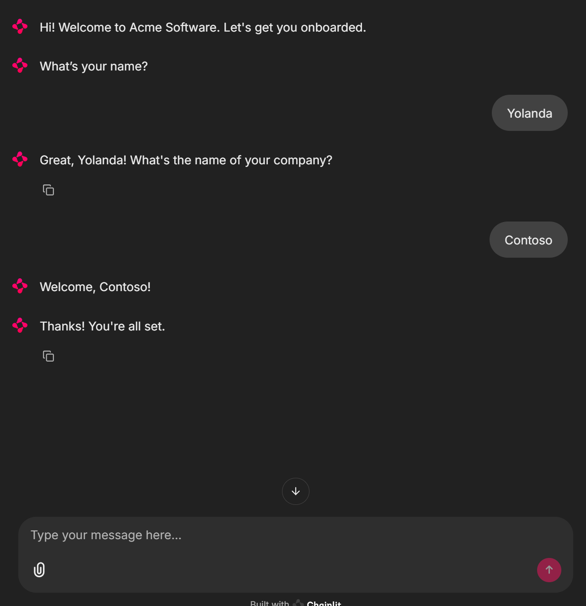
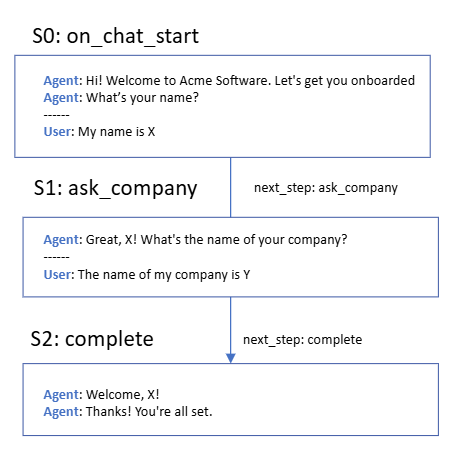

# Sequential Chat Flow - Example Agents

- *Simple Chat Agent*: Implementation of a basic agent that follows a sequential conversation with just three steps.

- *Simple Chat Agent with Skills*: TODO

- *Simple Chat Agent with Multiple-Choice Actions*: TODO


## Simple Chat Agent

### Example execution
```
chainlit run sequential_chatflow/00_simple_chat_agent.py -w
```



### Implementation workflow


## Simple Chat Agent with Skills

## Simple Chat Agent with Multiple-Choice Actions

## Simple Chat Agent with Multiple-Choice Actions